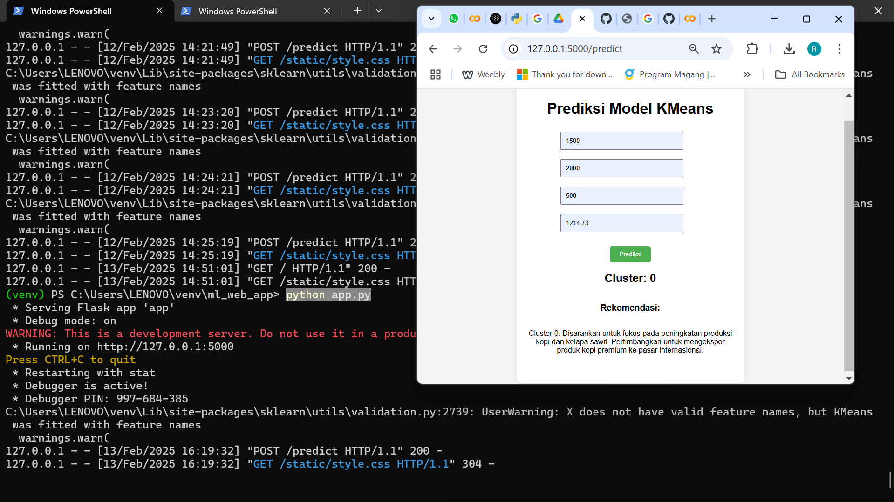

<div align="center" id="top"> 
  

  &#xa0;

  <!-- <a href="https://{{app_url}}.netlify.app">Demo</a> -->
</div>

<h1 align="center">Machine Learning KMeans Model di Windows 11</h1>

<p align="center">
  
  
  
  
</p>

<!-- Status -->

<!-- <h4 align="center"> 
	🚧  {{app_name}} 🚀 Under construction...  🚧
</h4> 

<hr> -->

<p align="center">
  <a href="#dart-about">About</a> &#xa0; | &#xa0; 
  <a href="#sparkles-features">Features</a> &#xa0; | &#xa0;
  <a href="#rocket-technologies">Technologies</a> &#xa0; | &#xa0;
  <a href="#white_check_mark-requirements">Requirements</a> &#xa0; | &#xa0;
  <a href="#checkered_flag-starting">Starting</a> &#xa0; | &#xa0;
  <a href="https://github.com/riskaapriliait" target="_blank">Author</a>
</p>

<br>

## :dart: About ##

Projek ini merupakan cara Deploy Machine Learning yang sudah dilatih menggunakan Google Colab dan Flask

## :sparkles: Features ##

:heavy_check_mark: Isi Data;\
:heavy_check_mark: Melakukan Prediksi Data;\
:heavy_check_mark: Mengetahui Cluster dan Memberi Rekomendasi Berdasarkan Cluster dari Data yang Diprediksi;

## :rocket: Technologies ##

The following tools were used in this project:

- [Google Colab](https://colab.research.google.com/)
- [Flask](https://flask.palletsprojects.com/en/stable/installation/)
- [pip](https://pypi.org/project/pip/)

## :white_check_mark: Requirements ##

Before starting :checkered_flag:, you need to have :
- python
- pip
- library python (numpy, etc)

## :checkered_flag: Starting ##
## :checkered_flag: Step 1 ##
```bash
# Buka Terminal dan cek versi Python dan pip
# Python
$ python --version
atau
$ python3 --version

#pip
$ pip --version
atau 
$ pip3 --version

Info : Jika tidak memiliki Python atau pip terinstal, maka instal terlebih dahulu dengan mengunduh [Python] (https://www.python.org/downloads/) dari situs resmi.
```

## :checkered_flag: Step 2 ##
Sangat disarankan untuk menggunakan virtual environment untuk proyek Python Anda agar dependensi proyek tidak bercampur dengan proyek lain. Anda dapat membuat virtual environment dengan perintah berikut:

```bash
# Buat folder projek atau buka projek program Anda sebelumnya dan masuk directory projek dalam terminal Anda :
$ cd path/to/your/project  // sesuaikan lokasi path projek Anda berada

# Buat Virtual Environment :
$ python -m venv venv

atau jika menggunakan python 3

$ python3 -m venv venv

# Aktifkan Virtual Environment :
$ venv\Scripts\activate
```
Setelah virtual environment diaktifkan, Anda akan melihat nama virtual environment (misalnya, (venv)) di awal prompt terminal Anda.


Untuk menonaktifkan Virtual Environment setelah Anda selesai bekerja dengan aplikasi Flask, Anda dapat menonaktifkan virtual environment dengan menjalankan perintah pada terminal :
```bash
$ deactivate
```


## :checkered_flag: Step 3 ##
Setelah virtual environment diaktifkan (optional), Anda dapat menginstal Flask dengan perintah berikut:

```bash
# Instal Flask di terminal :
$ pip install Flask

atau jika menggunakan python 3 dan pip 3, Anda mungkin perlu menggunakan

$ pip3 install Flask

# Verifikasi Instalasi untuk memastikan Flask terinstal dengan benar :
$ pip show Flask
```

## :checkered_flag: Step 4 ##
Setelah Flask terinstal, Anda dapat memulai membuat aplikasi Flask dengan membuat file Python (misalnya `app.py`) dan menulis kode Flask di dalamnya.

Contoh sederhana untuk memulai aplikasi Flask untuk dapat memastikan proses instalasi berjalan maka dapat dilakukan dengan mencoba dengan menulis kode berikut dalam direktory yang telah dibuat dengan membuat file app.py :

```bash
from flask import Flask

app = Flask(__name__)

@app.route('/')
def home():
    return "Hello, Flask!"

if __name__ == "__main__":
    app.run(debug=True)
```


Simpan file app.py yang sudah diupdate. Kemudian pada terminal, jalankan aplikasi dengan perintah :
```bash
$ python app.py

atau jika Anda menggunakan Python 3 :

$ python3 app.py
```
Akses aplikasi Anda di browser dengan membuka Akses aplikasi Anda di browser dengan membuka (http://127.0.0.1:5000/). Maka Anda seharusnya dapat melihat pesan "Hello Flask!" di halaman browser.


## :checkered_flag: Step 5 ##
Jika code sudah berhasil, saatnya mengembangkan aplikasi Flask.
### 1. Buat struktur proyek dalam directory folder venv (atau disesuaikan nama directory proyek aplikasi Flask Anda)
- Buat folder baru bernama ml_web_app
- Buka Code Editor yang Anda gunakan. 
    Misalnya Visual Studio Code. Kemudian buat struktur proyek berikut :
```bash
ml_web_app/
├── app.py
├── model/
│   └── your_model.pkl  # Simpan model ML Anda di sini
├── templates/
│   └── index.html      # Halaman utama aplikasi
└── static/
    └── style.css       # File CSS untuk styling (opsional)
```


- Simpan Model ML yang sudah dilatih dari Google Colab. 
    Jika Anda telah melatih model menggunakan Google Colab, simpan model tersebut ke dalam file. Misalnya, jika Anda menggunakan pickle untuk menyimpan model dapat dilakukan dengan menambahkan kode berikut pada projek ML Google Colab Anda :

### Perubahan yang harus ditambahkan pada Google Colab dan lakukan running kembali secara keseluruhan :
- import library pickle :


```bash
with open('/content/drive/MyDrive/Penelitian/Clustering Pertanian Jatim (Bu Amal)/kmeans_model.pkl', 'wb') as f:
    pickle.dump(kmeans_raw, f)
```
- Mengunduh Model dari Google Colab
    Setelah model disimpan, Anda dapat mengunduh file model ML ke komputer dengan menggunakan kode berikut :
```bash
from google.colab import files

files.download('kmeans_model.pkl')
```
Jika model sudah terdownload, simpan pada directory projek ml_web_app --> model --> kmeans_model.pkl (cek kembali instruksi catatan pada struktur proyek jika bingung).

- isikan code-code berikut pada struktur proyek bagian `app.py`, `index.html`, dan `style.css` :

### app.py
```bash 
from flask import Flask, render_template, request
import pickle
import numpy as np

app = Flask(__name__)

# Memuat model KMeans dari file
with open('model/kmeans_model.pkl', 'rb') as f:
    kmeans_model = pickle.load(f)

# Rekomendasi berdasarkan cluster
recommendations = {
    0: "Cluster 0: Disarankan untuk fokus pada peningkatan produksi kopi dan kelapa sawit. Pertimbangkan untuk mengekspor produk kopi premium ke pasar internasional.",
    1: "Cluster 1: Disarankan untuk meningkatkan produksi sarang burung walet. Produk ini memiliki permintaan tinggi di pasar Asia.",
    2: "Cluster 2: Disarankan untuk diversifikasi produk dengan mengekspor susu dan olahannya. Pasar luar negeri sangat membutuhkan produk susu berkualitas.",
    3: "Cluster 3: Disarankan untuk diversifikasi produk dan fokus pada pemasaran produk berkualitas. Pertimbangkan untuk mengekspor kopi dan produk olahan susu ke pasar internasional.",
}

@app.route('/')
def home():
    return render_template('index.html')

@app.route('/predict', methods=['POST'])
def predict():
    # Mengambil data dari form
    kopi = float(request.form['kopi'])
    kelapa_sawit = float(request.form['kelapa_sawit'])
    sarang_burung_walet = float(request.form['sarang_burung_walet'])
    susu_dan_olahannya = float(request.form['susu_dan_olahannya'])

    # Membuat array fitur untuk prediksi
    features = np.array([[kopi, kelapa_sawit, sarang_burung_walet, susu_dan_olahannya]])

    # Melakukan prediksi
    prediction = kmeans_model.predict(features)

    # Mendapatkan rekomendasi berdasarkan cluster yang diprediksi
    cluster_number = prediction[0]
    recommendation_text = recommendations.get(cluster_number, "Rekomendasi tidak tersedia untuk cluster ini.")

    # Menampilkan hasil prediksi dan rekomendasi
    return render_template('index.html', 
                           prediction_text=f'Cluster: {cluster_number}', 
                           recommendation_text=recommendation_text)

if __name__ == "__main__":
    app.run(debug=True)
```

### index.html
```bash
<!DOCTYPE html>
<html lang="en">
<head>
    <meta charset="UTF-8">
    <meta name="viewport" content="width=device-width, initial-scale=1.0">
    <title>ML Web App</title>
    <link rel="stylesheet" href="{{ url_for('static', filename='style.css') }}">
    <style>
        .container {
            display: flex;
            flex-direction: column;
            align-items: center; /* Memposisikan konten di tengah secara horizontal */
            justify-content: center; /* Memposisikan konten di tengah secara vertikal */
            height: 100vh; /* Mengatur tinggi kontainer agar memenuhi viewport */
        }
        form {
            display: flex;
            flex-direction: column;
            width: 300px; /* Mengatur lebar form */
        }
        .submit-button {
            margin-top: 20px; /* Memberikan jarak di atas tombol */
            align-self: center; /* Memposisikan tombol di tengah */
        }
    </style>
</head>
<body>
    <div class="container">
        <h1>Prediksi Model KMeans</h1>
        <form action="/predict" method="post">
            <input type="text" name="kopi" placeholder="Produksi Kopi" required>
            <input type="text" name="kelapa_sawit" placeholder="Produksi Kelapa Sawit" required>
            <input type="text" name="sarang_burung_walet" placeholder="Produksi Sarang Burung Walet" required>
            <input type="text" name="susu_dan_olahannya" placeholder="Produksi Susu dan Olahannya" required>
            <button type="submit" class="submit-button">Prediksi</button>
        </form>
        <h2>{{ prediction_text }}</h2>
        <h3>Rekomendasi:</h3>
        <p>{{ recommendation_text }}</p>
    </div>
</body>
</html>
```

### style.css
```bash
body {
    font-family: Arial, sans-serif;
    background-color: #f4f4f4;
    text-align: center;
}

.container {
    width: 50%;
    margin: auto;
    padding: 20px;
    background: white;
    border-radius: 10px;
    box-shadow: 0 0 10px rgba(0, 0, 0, 0.1);
}

input {
    margin: 10px 0;
    padding: 10px;
    width: 80%;
}

button {
    padding: 10px 20px;
    background-color: #4CAF50;
    color: white;
    border: none;
    border-radius: 5px;
}
```

## :checkered_flag: Step 6 ##

Simpan file aplikasi Flask yang sudah diupdate. Kemudian pada terminal, masuk ke directory aplikasi jalankan aplikasi dengan perintah :
```bash
$ python app.py

atau jika Anda menggunakan Python 3 :

$ python3 app.py
```
Akses aplikasi Anda di browser dengan membuka Akses aplikasi Anda di browser dengan membuka (http://127.0.0.1:5000/). Maka Anda seharusnya dapat melihat aplikasi Anda di halaman browser.




### Info : jika terdapat error saat menjalankan aplikasi, maka lakukan instalasi library/module jika error yang terjadi karena belum adanya module yang terinstal, misalnya panda, numpy, dan lainnya.

Contoh error jika module pandas belum terinstal :


### Selamat Anda berhasil melakukan Deploy Aplikasi ML Anda !!!  
### Semoga Berhasil 
